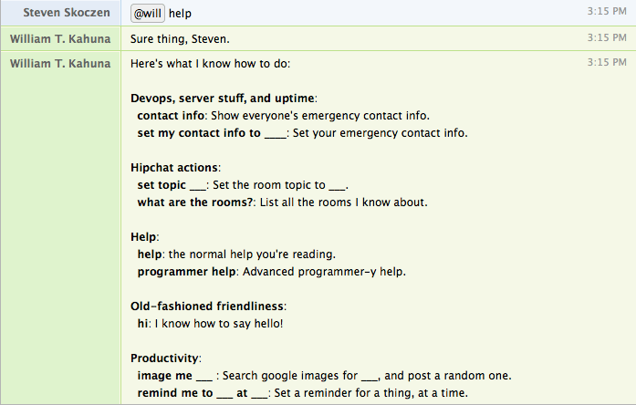
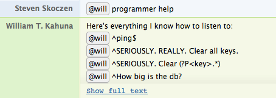
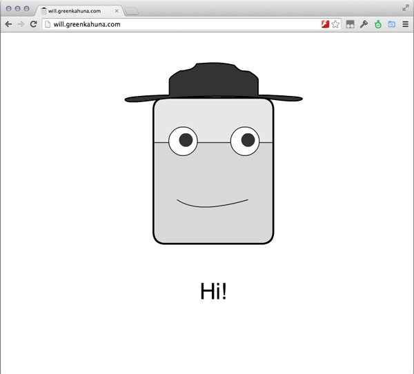

# Included Plugins

Will comes with batteries included, and already does a number of useful things - more are welcome via PR!  Note that not all of these commands are listed in `@will help` - some are rare enough that they didn't make sense to add.

Here's what he does out of the box:


## Administration

#### Keepalive

This plugin pings will once a minute at `PUBLIC_URL`, making sure his processes aren't idled in installations like heroku.

#### Ping

He's a robot. He should respond to ping. :)


#### Say

This provides a web endpoint at `/say/some-phrase` that will will speak into `DEFAULT_ROOM`.  Helpful for pay-no-attention-to-the-hand-behind-the-curtain demos.


#### Storage

Provides several **admin-only** commands for manipulating will's underlying storage.  These methods are also case-sensitive, because they can do Bad Things.

- **@will How big is the db?**: Lists the db size in human-friendly units.
- **@will SERIOUSLY. Clear ____**: Clears a key from the storage
- **@will SERIOUSLY. REALLY. Clear all keys.**: Clears *everything* from storage.  Will will definitely not work after this without a restart, and will tell you so.
- **@will Show me the storage for ____**: Shows the raw storage value for a given key.


## Chat rooms

Provides a couple of methods for listing and updating will's internal chat room knowledge, and manipulating the current room.

- **@will what are the rooms?**:  List the rooms he knows about, including their hipchat IDs.
- **@will who is in this room?**: List all the participants of the room he's in, including their name and mention name. 
- **@will update the room list**:  Get a new list of rooms from the chat server.
- **@will new topic ____**:   Set the room topic.

## Devops

Will is our devops team at GreenKahuna, and in the long term, we plan to abstract and include our stack deployer as a plugin.  For the moment, he just includes a couple basics:

#### Emergency Contacts

Saves a set of emergency contacts for team members, and provides a way for anyone on the team to get them in, well, emergencies.

- **@will set my contact info to ____**: Accepts a multi-line string with whatever contact info you want to provide.
- **@will contact info**: Lists contact info for all the team members who have provided it.

#### Github status

Github is a critical piece of infrastructure for most dev shops.  When it's having troubles, it's good to know.  This plugin checks github's [status api](https://status.github.com/api/), and alerts chat with the problem when they go down, and again when they're back up.


#### Heroku status

Heroku is also really widely used, and if you use it, when it's having troubles, it's good to know.  This plugin checks heroku's [status api](http://status.heroku.com), and alerts chat with the problem when they go down, and again they're back up.

Note: if you don't use heroku, remember you can always disable this plugin in `config.py`:

```python
PLUGIN_BLACKLIST = [
    "will.plugins.devops.heroku_is_up",
]
```

#### PagerDuty integration

In case if you have a PagerDuty account and the PD alerts are integrated with your HipChat server, you probably want this feature. You can acknowledge/resolve incidents using @will and what's more, you can set up a maintenance window as well!

If you've set both `PAGERDUTY_SUBDOMAIN` and `PAGERDUTY_API_KEY` and enabled the plugin in `config.py` - since it's disabled by default - the plugin will work for you. Get one full access api key from https://YOURSUBDOMAIN.pagerduty.com/api_keys.

This plugin assumes that your PagerDuty e-mail address and your HipChat e-mail address are the same, this is how will associates your HipChat account with PagerDuty account.

##### Acknowledge

You can acknowledge the ongoing incidents. You can do 3 things:

- **@will pd ack**: Acknowledge all open incidents assigned to you
- **@will pd ack!**: Acknowledge all open incidents
- **@will pd ack [incident number 1] [incident number 2]**: Acknowledge one or more specific incidents


##### Resolve

You can resolve the acknowledged incidents. You can do 3 things:

- **@will pd resolve**: Resolve all acknowledged incidents assigned to you
- **@will pd resolve!**: Resolve all acknowledged incidents
- **@will pd resolve [incident number 1] [incident number 2]**: Resolve one or more specific incidents


##### Reassign

You can reassign one or more incidents to somebody else. 

**@will pd reassign [incident number 1] [incident number2] [mention name]**: reassign one or more specific incidents.


##### Schedule maintenance window

You can schedule a maintenance window for a specific service. The last - hour - parameter is optional. The default value is `1 hour`.

**@will pd maintenance [service name] [hour(s)]h**: Schedule a new maintenance window for x hours


## Friendly

Will has personality, and we love that about him.  The friendly module includes some nice, silly, and appreciative aspects to will that really rounds out his personality.

#### Good morning / Good night

Will responds to "good morning", and "good night" appropriately, if he hears it.  If it's Friday, he'll even tell you to have a good weekend!

#### Hello

Saying hello is important.


#### Thanks

A little politeness goes a long way.


#### Cookies

We promised silly.


#### That's what she said.

Because seriously, bro. Read some awesome thought-provoking quotes, instead.


#### Love

One day, you'll find yourself saying this.  The response will make your week.


## Fun

There are a number of fun-facing plugins.  Check 'em out in the fun module or let them surprise you.


## Help

#### Help

Lists all the plugin commands with docstrings, bundled by module.



#### Programmer help

List all regexes for registered `@hear` and `@respond_to` decorators.  This is what help used to be, and may be pulled in the near future.



## Productivity

#### Bitly

If you want to shorten long URL using Bitly API, Will can do that for you in a few seconds:


#### Hangout

If you've set a `HANGOUT_URL`, will will toss it in chat for you:


#### Image me

Sometimes, a picture is worth a thousand words.


To get image me running, you'll need to have a Google API key, and custom search key, set in `config.py`.

```python
# config.py
GOOGLE_API_KEY = "FILL THIS IN"
GOOGLE_CUSTOM_SEARCH_KEY = "FILL THIS IN"
```

#### Remind me

This saves our bacon every day. Timeboxes meetings, helps people remember appointments, and enforces self-control.


Then, when it's 3pm, and I still haven't stopped coding to eat:


Or, more practically,


#### Remind somebody

You can also remind others as well.


#### World time

We're a remote company. Maybe you are too. Or your clients are.  Or the light/dark cycle of the world just fascinates you.  If any of these are you,

1. Get a free `WORLD_WEATHER_ONLINE_V2_KEY` from [world weather online](http://developer.worldweatheronline.com).
2. Get the time in pretty much any city on earth.  Even our globe-trotting CEO hasn't been able to stump him.


## Version

Provides information about the release version of @will.

- **@will version**: Show the current running version.

## Web

This module's all about web-facing content.

#### Home page
Will also includes a home page, so you can fire him, up, browse to his URL, and see his smiling face.




You now know everything about plugins.  Maybe you're wondering about the [finer points of config](../config.md)?  Or perhaps, you're ready to [deploy your will](../deploy.md)?